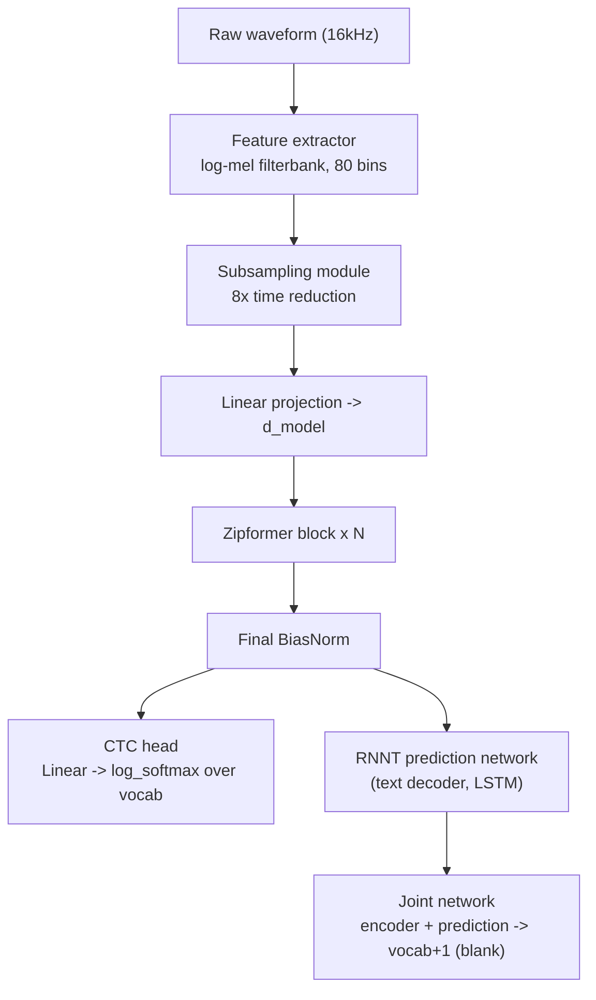
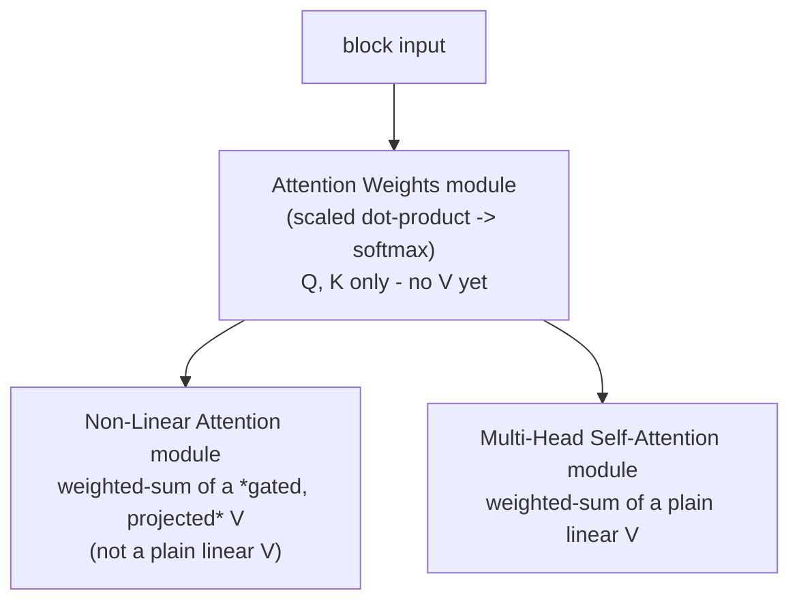
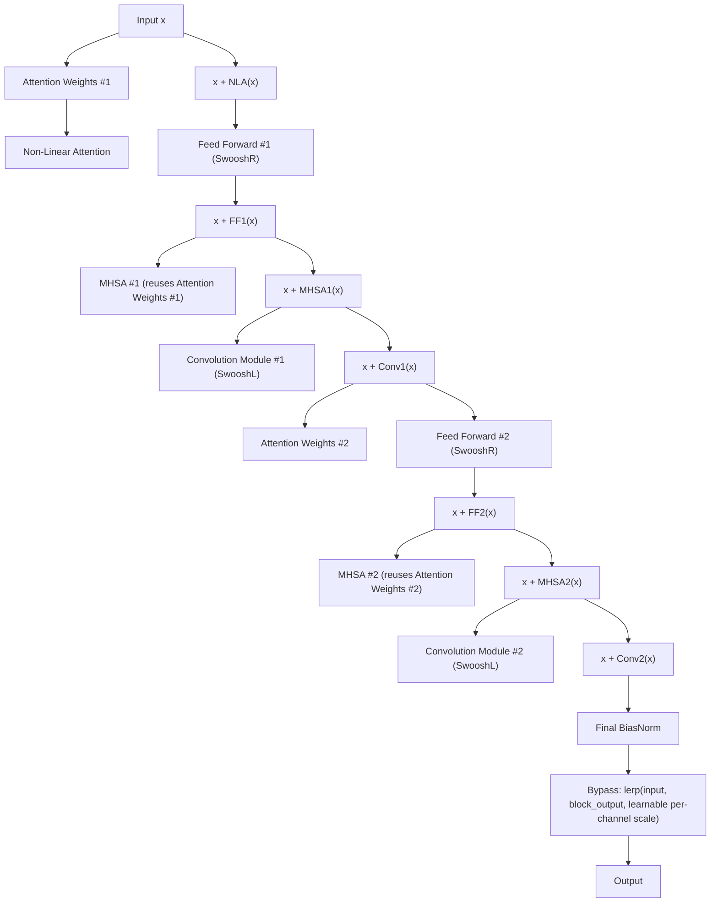

# Zipformer — Architecture Reference

Reference for implementing Zipformer (Yao, Guo, Yao et al., ICLR 2024 —
["Zipformer: A faster and better encoder for automatic speech recognition"](https://www.danielpovey.com/files/2024_iclr_zipformer.pdf))
from scratch, module by module. There is no NeMo/HuggingFace-style
pip-installable Zipformer — the reference implementation lives in
[k2-fsa/icefall](https://github.com/k2-fsa/icefall) on top of `k2`+`lhotse`,
which is a heavy, non-pip-installable stack (`k2` needs a CUDA/torch-matched
wheel, `icefall` is clone-and-run-scripts, not a library). This repo instead
follows the same "build it module by module in one file" approach the sibling
`conformer-training-pipeline` repo used for FastConformer.

**Scope note**: production Zipformer uses a U-Net-style encoder with multiple
stacks running at different downsampled frame rates (e.g. 2x/4x/8x/4x/2x),
which is where most of its speed advantage over Conformer comes from. This
implementation is a **single-stack** Zipformer: one embedding dimension and
frame rate throughout, no down/upsampling between stacks. What's kept
faithful is the **block internals** — BiasNorm, shared attention weights,
non-linear attention, Swoosh activations, and the learnable bypass — which is
where Zipformer's block-level design actually differs from Conformer. See
"Multi-stack extension" at the bottom for what full parity would add.

## 1. End-to-end pipeline



Feature extraction, subsampling, and the CTC/RNNT heads are unchanged from
FastConformer (see the sibling repo's `ARCHITECTURE.md` for those) — only the
encoder block (`E`/`F`) and its normalization differ, which is what's
described below.

## 2. BiasNorm (replaces LayerNorm)

LayerNorm centers *and* rescales every vector to unit variance, which turns
out to erase useful magnitude information the network could otherwise
carry between layers. BiasNorm keeps the original vector's direction and
mean, and only uses a learned bias to compute the *scale*:

```
BiasNorm(x) = x / rms(x - bias) * exp(log_scale)

where rms(v) = sqrt(mean(v^2, dim=channel))
  bias:      learnable, one value per channel
  log_scale: learnable scalar (shared across channels)
```

Note the numerator is `x` itself (not `x - bias`) — `bias` only shapes the
denominator's scale estimate. `log_scale` is learned in log-space so the
effective scale (`exp(log_scale)`) can't go to zero or negative.

Module file suggestion: `bias_norm.py` (or a class in `model.py`).

## 3. Swoosh activations (replace Swish/ReLU)

Zipformer uses two smooth activations tuned to avoid a dead zone near zero
that Swish has:

```
SwooshR(x) = log(1 + exp(x - 1)) - 0.08*x - 0.313   (used in feed-forward modules)
SwooshL(x) = log(1 + exp(x - 4)) - 0.08*x - 0.035    (used in conv modules)
```

Both are close to `softplus` shifted and shrunk, minus a small linear term
(keeps a small negative slope for x << 0, like a leaky activation, rather
than saturating at exactly 0).

Module file suggestion: `activations.py` (or functions in `model.py`).

## 4. Shared attention weights + non-linear attention (NLA)

The key efficiency idea: computing `softmax(QK^T)` attention weights is
expensive, and Conformer only uses them once per attention module. Zipformer
computes one shared attention-weight tensor per "attention pass" and reuses
it for **two** different modules in the same block:



- **Attention Weights module**: like standard MHSA's `Q`/`K` projections +
  scaled dot product + softmax, but stops there — it produces the `(B, H, T, T)`
  weight tensor and nothing else. Uses a *smaller* head dim than the model's
  main `d_model` (e.g. 24-32 per head) since attention weights don't need to
  carry much information, just relative-importance signal.
- **Non-Linear Attention (NLA) module**: projects `x` to three parts (values,
  and two gating tensors `A`/`B`), computes `gated = tanh(A) * sigmoid-ish
  gate(B) * values` (a GLU-like nonlinearity applied *before* the weighted
  sum, unlike standard attention which is linear in `V`), then applies the
  shared attention weights as a weighted sum over gated values, followed by
  an output projection.
- **MHSA module**: standard `softmax(QK^T/sqrt(d)) @ V` reusing the same
  attention weights (skips recomputing `QK^T`), just does its own `V`
  projection + output projection.

Because both NLA and MHSA reuse one attention-weight computation, a Zipformer
block gets attention-driven mixing twice for roughly the cost of computing
attention scores once.

Relative positional encoding (Transformer-XL style, same as Conformer) feeds
into the Attention Weights module the same way it feeds Conformer's MHSA.

Module file suggestion: `attention.py`.

## 5. Zipformer block

Where Conformer's block is a 4-module macaron sandwich (FF, MHSA, Conv, FF),
Zipformer's block interleaves two attention consumers with two feed-forward
and two convolution modules, computing shared attention weights **twice**
per block (once for the first half, once for the second half — not once
per module) to balance cost against Conformer's single value:



This implementation simplifies slightly: it computes attention weights **once
per block** (shared by NLA + both MHSA calls) rather than twice, trading a
little of the original's speed/accuracy balance for a simpler block — the
normalization/activation/bypass design (the part that actually distinguishes
Zipformer from Conformer) is kept faithful.

### 5a. Bypass module

Every block's output is mixed back with its input through a **learnable,
per-channel scale** rather than a plain residual add or a fixed stochastic-depth
drop rate:

```
BypassModule(x, block_out) = x + scale * (block_out - x)
scale: learnable, per-channel, initialized near 1.0, clamped to [min_scale, 1.0]
```

This lets deep stacks of blocks train stably (a channel can "skip" a block
almost entirely, `scale ~ min_scale`, without a hard architectural gate) —
useful once you stack many Zipformer blocks.

## 6. Feed-forward and convolution modules

Same shape as Conformer's, just BiasNorm instead of LayerNorm and Swoosh
instead of Swish:

```
FeedForwardModule:
  BiasNorm -> Linear(d, d*ff_expansion) -> SwooshR -> Dropout
           -> Linear(d*ff_expansion, d) -> Dropout

ConvolutionModule:
  BiasNorm
    -> Pointwise Conv1d(d, 2d, kernel=1)
    -> GLU
    -> Depthwise Conv1d(d, d, kernel=K, groups=d)
    -> BiasNorm (Zipformer drops BatchNorm entirely, unlike Conformer)
    -> SwooshL
    -> Pointwise Conv1d(d, d, kernel=1)
    -> Dropout
```

## 7. Encoder assembly

```
subsampled_features -> [ZipformerBlock] x N -> final BiasNorm -> encoder_output
```

## 8. CTC / RNNT heads

Unchanged from FastConformer — see the sibling repo's `ARCHITECTURE.md`
sections 7-8. `model.py` reuses the same `CTCHead` / `RNNTPredictionNetwork`
/ `RNNTJoint` design.

## 9. Optimizer note (ScaledAdam / Eden)

The reference icefall recipes pair Zipformer with a custom **ScaledAdam**
optimizer (per-parameter-tensor update scaling based on that tensor's own
norm) and an **Eden** LR schedule (hold-then-decay, shaped by both step and
epoch). This repo uses plain `AdamW` + warmup/inverse-sqrt decay (same as the
sibling FastConformer repo) for simplicity — BiasNorm and the bypass module
are the parts of Zipformer that most help with plain-Adam training
stability anyway, so this is a reasonable simplification, not a load-bearing
one.

## 10. Suggested module-by-module build order

1. `activations.py` — SwooshR/SwooshL (verify against the formulas above for
   a few sample inputs).
2. `bias_norm.py` — BiasNorm (verify: output RMS over `x - bias` is
   `exp(log_scale)`; unlike LayerNorm, output mean is not forced to zero).
3. Reuse `features.py`/`subsampling.py`/`positional_encoding.py` design from
   the FastConformer reference (identical here).
4. `attention.py` — Attention Weights module, Non-Linear Attention module,
   MHSA module sharing those weights (hardest part — verify shapes: weights
   `(B, H, T, T)`, NLA output `(B, T, d_model)`, MHSA output `(B, T, d_model)`).
5. `feed_forward.py` / `convolution.py` — same shape as Conformer's, swap in
   BiasNorm + Swoosh.
6. `bypass.py` — per-channel learnable lerp, clamped scale.
7. `zipformer_block.py` — compose 4-6 in the order in section 5.
8. `encoder.py` — stack N blocks + subsampling + final BiasNorm.
9. `ctc_head.py`, `rnnt_prediction.py`, `rnnt_joint.py` — copy from the
   FastConformer reference unchanged.
10. `model.py` — wire it all together, exposing the same
    `forward_ctc(waveform, waveform_lengths)` /
    `forward_rnnt(waveform, waveform_lengths, targets)` interface `train.py`/
    `eval.py` expect (matches the sibling repo's convention so `train.py`/
    `eval.py`/`dataset.py` port over almost unchanged).

## 11. Multi-stack extension (not implemented here)

Full-parity Zipformer replaces step 8 above with multiple stacks at
different frame rates, e.g. (relative to the subsampled input):
`[1x @ d=192, 2x @ d=256, 4x @ d=384, 8x @ d=512, 4x @ d=384, 2x @ d=256, 1x @ d=192]`,
downsampling between stacks with a learned weighted-average
(`SimpleDownsample`) and upsampling back with nearest-neighbor duplication
plus a `BypassModule` merge against the matching pre-downsample stack's
output (U-Net-style skip connections). This is where most of the paper's
reported speed/WER improvement over Conformer comes from, and would be the
natural next step after the single-stack version here is training
correctly.
